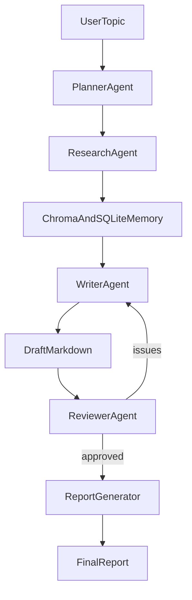

# Autonomous Multi-Agent AI Research & Report Assistant

CLI-first, student-friendly multi-agent RAG project that looks modern in interviews without heavy infrastructure.

## What It Does
- Takes a topic such as `Analyze the EV market in India` or `Explain BERT vs GPT`.
- Uses a Planner agent to decompose work and define sections/rubric.
- Uses a Research agent to search, fetch, extract, chunk, and store evidence.
- Uses a Writer agent to generate grounded markdown sections with citations.
- Uses a Reviewer agent to critique coverage/citations and trigger one regeneration pass.
- Exports final report to Markdown (PDF optional).

## Architecture

## Tech Stack
- Python
- Agent orchestration: modular agents (CrewAI-ready design)
- LLM runtime: Ollama (default) or Groq (optional)
- Vector memory: ChromaDB
- Metadata catalog: SQLite
- Retrieval/extraction: `requests`, `BeautifulSoup`
- Embeddings: `sentence-transformers`
- Optional UI: Streamlit

## Folder Structure
- `src/app/`: CLI and orchestrator
- `src/agents/`: planner/research/writer/reviewer/report agents
- `src/tools/`: web search/fetch/extract and retrieval helpers
- `src/memory/`: SQLite + Chroma + memory manager
- `src/schemas/`: typed JSON contracts between pipeline stages
- `src/reporting/`: markdown template + export helpers
- `src/config/`: settings and model defaults
- `src/utils/`: logging, retry, hashing
- `tests/`: core unit tests
- `data/`: generated run artifacts (runtime)

## Quickstart
1. Create environment and install:
   - `python -m venv .venv`
   - Windows PowerShell: `.venv\Scripts\Activate.ps1`
   - `pip install -e .`
2. Start Ollama and pull model (example):
   - `ollama pull llama3:8b-instruct`
3. Run:
   - `python -m src.app.main --topic "Explain BERT vs GPT" --max-sources 8 --max-chunks 30`

### Optional (Groq)
- Set env vars:
  - `LLM_PROVIDER=groq`
  - `GROQ_API_KEY=...`
  - `LLM_MODEL=llama-3.1-8b-instant`

### Optional (PDF export)
- `pip install -e .[pdf]`
- Add `--pdf` in run command.

### Offline fallback (no LLM runtime)
- Use `--provider mock` for deterministic local demo outputs when Ollama/Groq is unavailable.

## CLI Options
- `--topic` (required)
- `--max-sources` (default: 8)
- `--max-chunks` (default: 30)
- `--provider` (`ollama`, `groq`, or `mock`)
- `--model` (override model name)
- `--pdf` (optional PDF export)
- `--dry-run` (skip web retrieval)

## Run Artifacts (Production-Style Traceability)
Each run saves:
- `plan.json`
- `retrieval_manifest.json`
- `draft.md`
- `claim_map.json`
- `review.json`
- `final.md` (+ `final.pdf` if enabled)
- `run.log` (structured JSON events)

## Demo Workflows
1. **Concept Demo**
   - Topic: `Explain BERT vs GPT and when to use each`
   - Show: plan sections, grounded citations, reviewer feedback loop.
2. **Market Research Demo**
   - Topic: `Analyze the EV market in India (2020-2026 trends)`
   - Show: source collection + sectioned trend synthesis.
3. **Applied ML Demo**
   - Topic: `Research CNN architectures for emotion detection`
   - Show: architecture comparison + implementation notes with citations.

## MVP vs Advanced
### MVP
- Planner -> Research -> Writer -> Reviewer -> Report loop
- Persistent semantic memory
- Citation-aware markdown report generation
- Regeneration trigger on review failures

### Advanced
- Streamlit dashboard with live progress
- Better re-ranking and query diversification
- Confidence/quality scoring
- Domain-specific retrieval modes
- Evaluation harness with historical scoring

## Interview Positioning
- Emphasize **separation of concerns** across agents.
- Emphasize **grounding + citations** for hallucination reduction.
- Emphasize **memory architecture**: Chroma retrieval + SQLite provenance.
- Emphasize **deterministic controls**: retrieval budgets, JSON contracts, run artifacts.

## Common Interview Questions (Strong Angles)
- **How do you reduce hallucinations?**
  - Writer consumes retrieved chunks only; report requires citations per factual section; reviewer checks citation coverage.
- **Why multi-agent?**
  - Better debuggability and control: planning, retrieval, synthesis, and critique are isolated and measurable.
- **How does memory work?**
  - Chunks are embedded into Chroma, with source provenance + dedupe hash in SQLite.

## Resume Bullet Ideas
- Built an autonomous multi-agent RAG assistant that decomposes user research goals, retrieves grounded evidence, and generates citation-backed reports with a self-critique loop.
- Designed a persistent semantic memory system using Chroma embeddings and SQLite provenance metadata with chunk-level deduplication.
- Implemented structured JSON contracts between planning, retrieval, writing, and review stages to improve reliability and explainability.
- Engineered report generation with markdown artifacts, deterministic retrieval budgets, and logging for reproducible AI workflows.

## Error Handling and Reliability
- Request retries with exponential backoff.
- Network timeouts and extraction fallbacks.
- Deduplication via chunk hash.
- JSON repair pass for planner outputs.
- Controlled budgets for source/chunk growth.

## Future Improvements
- Streamlit dashboard with citation explorer.
- Section-level targeted regeneration.
- Retrieval re-ranking and query diversification.
- Better evaluation metrics and benchmark topics.

## License
MIT (recommended).
